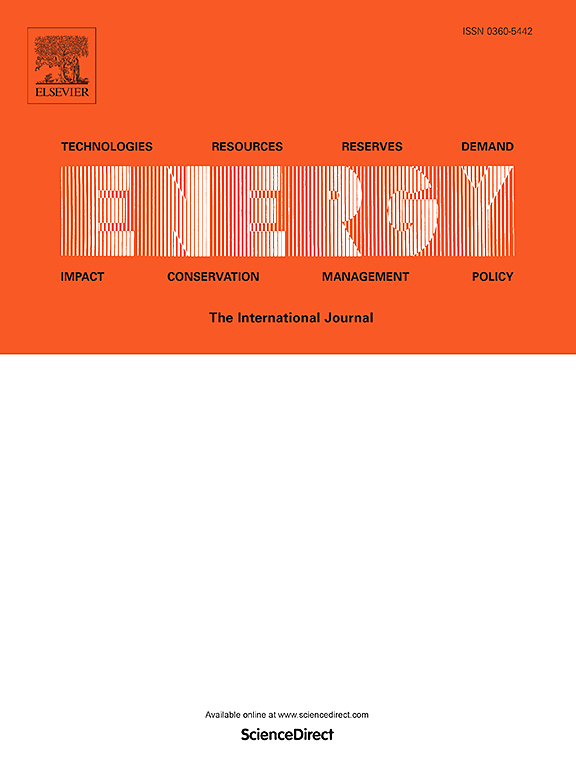

# Studies & Publications

My academic work focuses on **low-carbon energy systems**, **power system planning and optimisation**, **hybridisation of generation sources**, and **strategic engineering under uncertainty**.

Below you can find a curated list of my **journal articles**, **conference papers**, **book chapters**, and **patents**.  
This list is regularly updated. A full and up-to-date record is also available on  
👉 [Google Scholar](https://scholar.google.com/citations?user=9rfu638AAAAJ&hl=en)

---

## 📘 Journal Articles

### **Maximising Sustainability: Planning and Optimization Strategies for Achieving 100% Renewable Energy Communities in Remote Islands — A Case Study of Corvo Island, Portugal**
- 🗓️ **2025**
- 👥 J. Graça Gomes, S. Sammarchi, Q. Yang, T. Yang, C. T. Chong, A. M. Sousa, J. S. Lim, *et al.*
- 🏷️ *Journal Article* · **Published**
- 📰 **Energy**
- 📄 Article DOI: [134802](https://doi.org/10.1016/j.energy.2025.134802)

---

  
  

    <strong>Hybrid Solar PV–Wind–Battery System Bidding Optimisation: A Case Study for the Iberian and Italian Liberalised Electricity Markets</strong> 
    🗓️ <strong>2023</strong> 
    👥 J. Graça Gomes, J. Jiang, C. T. Chong, J. Telhada, X. Zhang, S. Sammarchi, <em>et al.</em> 
    📰 <em>Energy</em> 
    🔗 <a href="https://www.sciencedirect.com/science/article/pii/S0360544222029292" target="_blank">View Article</a> 
    🏷️ Journal Article · ✔️ Published
  

---

### **Strategic Planning for a Resilient and Sustainable Energy Future: Analysis of a 100% Renewable Energy System for Portugal in 2050**
- 🗓️ **2023**
- 👥 J. Graça Gomes, T. Yang, J. Jiang, Y. Lin
- 🏷️ *Journal Article* · **Published**
- 📰 **Chemical Engineering Transactions**
- 📄 Volume 106 · Pages 403–408

---

### **An Optimization Study on a Typical Renewable Microgrid Energy System with Energy Storage**
- 🗓️ **2021**
- 👥 J. Graça Gomes, H. J. Xu, Q. Yang, C. Y. Zhao
- 🏷️ *Journal Article* · **Published**
- 📰 **Energy**
- 📄 Volume 234 · Article 121210

---

### **Optimal Operation Scheduling of a Pump Hydro Storage System Coupled with a Wind Farm**
- 🗓️ **2021**
- 👥 J. Graça Gomes, J. Telhada, H. Xu, A. Sá da Costa, C. Zhao
- 🏷️ *Journal Article* · **Published**
- 📰 **IET Renewable Power Generation**
- 📄 Volume 15 (1) · Pages 173–192

---

### **Modeling and Planning of the Electricity Energy System with a High Share of Renewable Supply for Portugal**
- 🗓️ **2020**
- 👥 J. Graça Gomes, J. M. Pinto, H. Xu, C. Zhao, H. Hashim
- 🏷️ *Journal Article* · **Published**
- 📰 **Energy**
- 📄 Volume 211 · Article 118713

---

## 📚 Book Chapters & Reports

### **Supply Chains of Green Hydrogen Based on Liquid Organic Carriers Inside China: Economic Assessment and Greenhouse Gas Footprint**
- 🗓️ **2024**
- 👥 J. Godinho, J. Graça Gomes, J. Jiang, A. Sousa, A. Gomes, B. H. Santos, H. A. Matos, *et al.*
- 🏷️ *Book Chapter*
- 📘 **Green Hydrogen in Power Systems**
- 📄 Pages 245–300

---

### **Life Cycle Assessment of Renewable Energy Sources Towards Climate Neutrality – Portuguese Case Study**
- 🗓️ **2023**
- 👥 A. Sousa, B. H. Santos, F. Carlos, H. Pombeiro, J. Graça Gomes, M. Gonçalves, *et al.*
- 🏷️ *Book Chapter*
- 📘 **Towards Climate Neutrality: Economic Impacts, Opportunities and Risks**
- 📄 Pages 180–198

---

### **The East Is Green: The Chinese Perspective for Carbon Neutrality**
- 🗓️ **2023**
- 👥 J. Graça Gomes, H. Pombeiro, T. Yang, J. Jiang
- 🏷️ *Professional Publication*
- 📰 **Ordem dos Engenheiros Magazine**

---

## 📄 Conference Papers

### **Review of Offshore Wind Projects Status: New Approach of Floating Turbines**
- 🗓️ **2022**
- 👥 J. Graça Gomes, Y. Lin, J. Jiang, N. Yan, S. Dai, T. Yang
- 🏷️ *Conference Paper*
- 🎤 **5th International Conference on Power and Energy Applications (ICPEA)**

---

### **Optimal Operation Scheduling of a Hybrid PV–Wind–Storage System in a Liberalized Electricity Market**
- 🗓️ **2021**
- 👥 J. Graça Gomes, J. Jiang, C. T. Chong, X. Zhang, S. Sammarchi, S. Wang, *et al.*
- 🏷️ *Conference Paper*
- 🎤 **7th International Conference on Low Carbon in Asia**

---

### **Semi-Spar Floating Ocean Wind Turbine: A New Approach for Classic Spar Foundation**
- 🗓️ **2023**
- 👥 Y. Lin, J. Graça Gomes, S. Dai, Y. Nie, P. Chen, J. Jiang
- 🏷️ *Conference Paper*
- 🎤 **ISOPE International Ocean and Polar Engineering Conference**

---

## 🧾 Patents

### **Pile Foundation for Offshore Wind Farms**
- 🗓️ **2022**
- 👥 Z. Xu, B. Cai, D. Hong, J. Graça Gomes, J. Wang
- 🏷️ *Patent*
- 📜 **CN Patent ZL202220786743.6**

---

### **Design of a New Solar Photovoltaic Inverter**
- 🗓️ **2022**
- 👥 X. Zhang, J. Graça Gomes, J. Jiang
- 🏷️ *Patent*
- 📜 **CN Patent ZL202230092482.3**

---

## 🔗 Academic Profiles
- 🎓 **Google Scholar**: https://scholar.google.com/citations?user=9rfu638AAAAJ&hl=en

