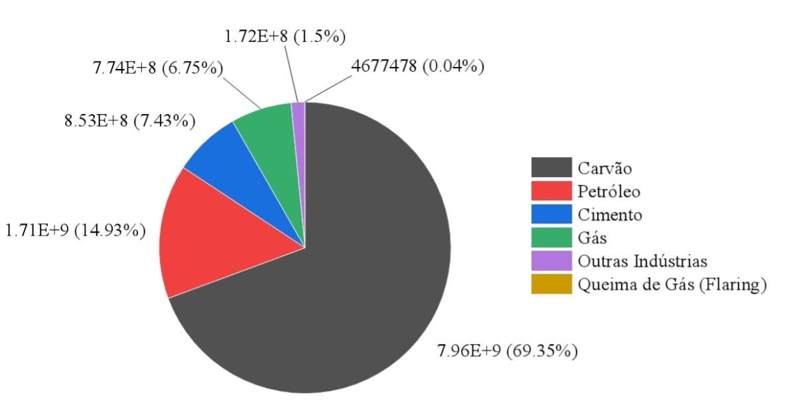
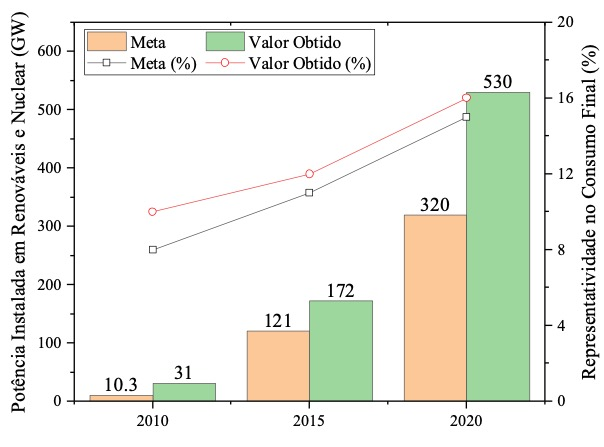
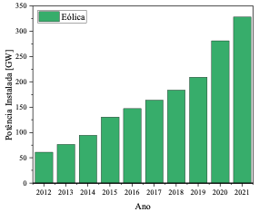
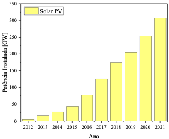
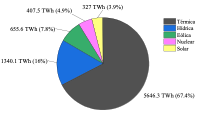

# O Oriente é Verde: A Perspetiva Chinesa para a Neutralidade Carbónica

**João Graça Gomes, Henrique Pombeiro, Yang Tianqi, Jiang Juan**

---

Desde a reforma económica de 1978, a República Popular da China tem verificado um rápido desenvolvimento socioeconómico, que se traduziu num crescimento médio do PIB de 9% ao ano, numa melhoria considerável dos serviços e infraestruturas do país e numa redução acentuada dos índices de pobreza. Não obstante, o crescimento económico exponencial chinês originou uma série de desafios no setor energético: entre 1978 e 2021, o consumo energético primário cresceu 845%, de 4.632 TWh para 43.791 TWh, e várias previsões apontam para que esta trajetória se mantenha nas próximas décadas.

Como expectável, o elevado consumo energético provocou um aumento das emissões de gases de efeito de estufa: no mesmo período, as emissões passaram de 1,49 mil milhões de toneladas de CO₂e para 11,47 mil milhões de toneladas de CO₂e, em grande parte devido às emissões dos setores de produção de eletricidade e calor, e à enorme preponderância do carvão.

*Fig. 1: Emissões de CO₂e por combustível e indústria (destacando produção de cimento), em 2021, República Popular da China. Unidades: toneladas.*

---

Ciente do impacto das emissões chinesas no clima global, o Governo da República Popular da China anunciou em 2020 que o país pretende reverter o seu papel de maior emissor global de CO₂ e alcançar a neutralidade carbónica até 2060. Isto implica reduzir as emissões remanescentes para valores iguais ou inferiores à capacidade de absorção das florestas nacionais.

A primeira etapa desta descarbonização consiste em assegurar que o pico de emissões de carbono ocorre antes de 2030, através de um processo de rápida transformação industrial. Tendo em conta o crescimento económico, a dimensão populacional e as diferenças geográficas do país, surgem questões fundamentais: **são estes objetivos realistas e que ações estão a ser promovidas para os alcançar?**

---

## Evidências do Realismo das Metas

Um primeiro argumento reside na redução da intensidade carbónica. Entre 2005 e 2020, esta diminuiu **48,4%**.

Em segundo lugar, a China tem ultrapassado consistentemente os objetivos internacionais de integração de energias renováveis. Nos três últimos Planos Quinquenais, registaram-se elevadas taxas de crescimento da potência instalada em fontes de baixo carbono (renováveis + nuclear).

*Fig. 2: Metas de integração de energias de baixo carbono no setor elétrico vs. valores obtidos, República Popular da China.*

---

## Análise por Tecnologia

### 1. Energia Eólica

A potência instalada cresceu **1.010%** em 11 anos, passando de 29,6 GW para 328,48 GW. Em 2020, foram instalados 72,3 GW, correspondendo a **63% da potência eólica global instalada nesse ano**.

*Fig. 3: Evolução da potência eólica (2012–2021), República Popular da China.*

---

### 2. Solar Fotovoltaico

Até ao final de 2021, a China detinha mais de **35% da potência solar fotovoltaica mundial**. Entre 2012 e 2021, a capacidade aumentou quase **7.200%**, de 4,2 GW para 306,56 GW. Cerca de **60% das fábricas de células fotovoltaicas** estão localizadas na China.

*Fig. 4: Evolução da potência solar fotovoltaica (2012–2021), República Popular da China.*

---

### 3. Energia Hídrica

Entre 2012 e 2021, a potência hídrica cresceu de 250 GW para 370 GW, incluindo **32 GW de capacidade de bombagem**, essencial para a integração de eletricidade renovável variável.

![solar(assets/hydro5.png)

*Fig. 5: Evolução da potência hídrica (2012–2021), República Popular da China.*

---

Apesar destes progressos, as energias de baixo carbono representam **menos de um terço da produção elétrica** e apenas **12,4% do consumo energético total**, quando se consideram transportes, aquecimento e arrefecimento.

 

*Fig. 6: a) Consumo elétrico b) Consumo energético primário, 2021, República Popular da China.*

---

## Estratégia para a Neutralidade Carbónica

Nos últimos anos, o governo chinês publicou documentos estratégicos fundamentais:

1. *Working Guidance for Carbon Dioxide Peaking and Carbon Neutrality*  
2. *Action Plan for Reaching Carbon Dioxide Peak Before 2030*  
3. *14th Five-Year Plan (2021–2025)*  

### Principais Objetivos

1. **Aumentar a quota de fontes de baixo carbono** para 20% em 2025 e 25% em 2030.  
2. **Substituição progressiva do carvão**, com 50% da eletricidade interprovincial de origem renovável.  
3. **Expansão eólica e solar** para pelo menos 1.200 GW até 2030.  
4. **Desenvolvimento nuclear**, incluindo reatores modulares e offshore.  
5. **Armazenamento de energia**, com 120 GW em hídrica reversível e 30 GW em baterias até 2025.  
6. **Redução do consumo de petróleo**, especialmente nos transportes.  
7. **Reutilização de resíduos industriais** na construção.  
8. **Promoção do transporte verde**, com 40% dos novos veículos elétricos ou a hidrogénio até 2030.  
9. **Desenvolvimento do hidrogénio verde**, incluindo projetos power-to-gas.  
10. **Aumento do investimento em I&D**, superior a 7% ao ano.  
11. **Reflorestação**, com aumento de 4,5 mil milhões de m³ de cobertura florestal até 2030.

---

## Conclusão

Apesar de desafios significativos — infraestruturas elétricas, dependência industrial de fósseis e necessidades financeiras —, os dados mostram que a China tem superado as suas próprias metas. Entre 2005 e 2020, reduziu drasticamente a intensidade carbónica e ultrapassou compromissos internacionais.

Com investimentos contínuos em energias renováveis, eficiência energética, infraestrutura verde e conservação florestal, a China tem potencial para liderar a transição energética global e contribuir decisivamente para o combate às alterações climáticas.

---

[← Back](../)
